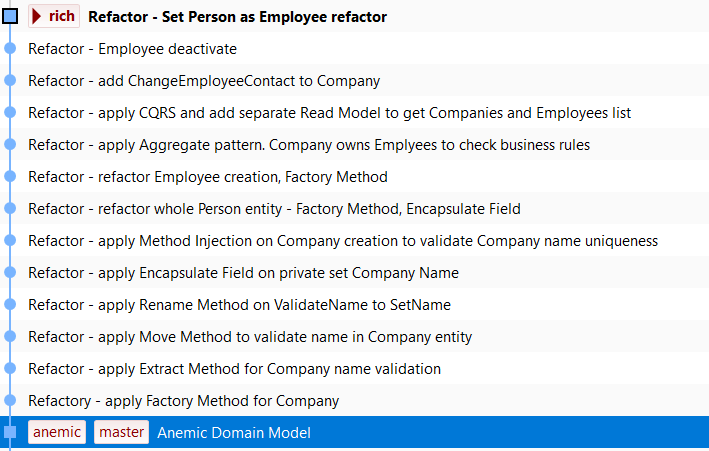

# Refactoring from anemic to rich Domain Model example

Demo repository for .NET virtual conference [https://dotnetconf.pl/](https://dotnetconf.pl/) live coding streaming: From Anemic To Rich Domain Model : Refactoring Live Session

## Description
**anemic** branch - anemic Domain Model, start of refactoring
**rich** branch - rich Domain Model, end of refactoring

